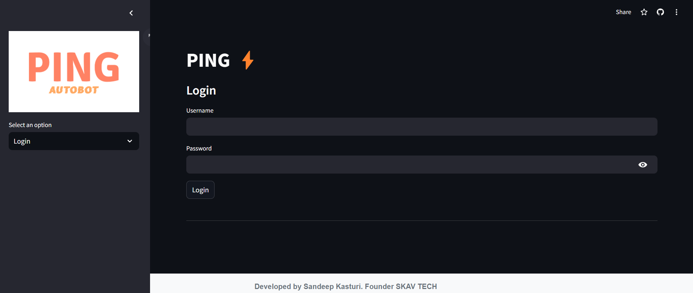
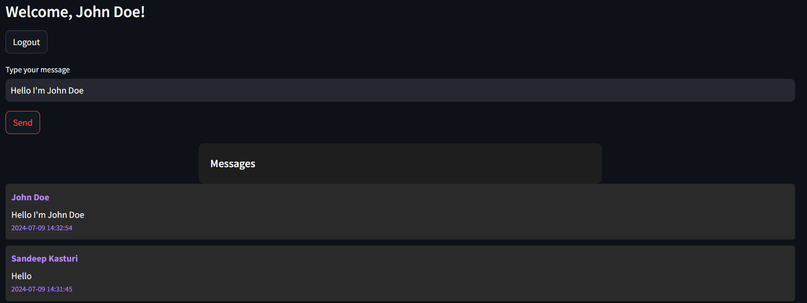

---

# PING ⚡

PING is a chat application developed by Sandeep Kasturi using Streamlit. It allows users to register, login, send messages, and interact with an AI assistant.

## Features

- **User Authentication**: Users can register with a username and password, login securely, and reset passwords if forgotten.
- **Admin Functionality**: Admins have additional privileges such as viewing and managing users, messages, and assigning temporary passwords.
- **Chat Interface**: Users can send messages in real-time and receive responses from an integrated AI assistant.
- **Database Integration**: SQLite database is used to store user information, messages, and temporary passwords securely.

## Installation

1. Clone the repository:

   ```bash
   git clone https://github.com/sandeepkasturi/PING.git
   cd PING
   ```

2. Install dependencies:

   ```bash
   pip install -r requirements.txt
   ```

3. Configure secrets:

   Ensure you have a `secrets.toml` file with the following structure:

   ```toml
   api_key = "your_generative_ai_api_key"
   ping_admin_username = "admin"
   ping_admin_password = "admin_password"
   ```

   Replace `"your_generative_ai_api_key"` with your actual API key from Generative AI.

4. Run the application:

   ```bash
   streamlit run app.py
   ```

## Usage

- Launch the application by running `app.py`.
- Use the sidebar to select login, registration, password reset, account deletion, or admin login.
- Upon login, users can send messages in the chat interface. Use `@autobot` followed by a question to interact with the AI assistant.

## Screenshots


*Login Page*


*Chat Interface with AI assistant*

## Contributing

Contributions are welcome! Please fork the repository and create a pull request for any improvements or fixes.

## License

This project is licensed under the MIT License - see the [LICENSE](LICENSE) file for details.

## Contact

For any inquiries or support, please contact Sandeep Kasturi at sandeep@example.com.

---

Adjust the sections as per your project's specific details and structure. Include relevant screenshots from your application to enhance the README's visual appeal and clarity.
